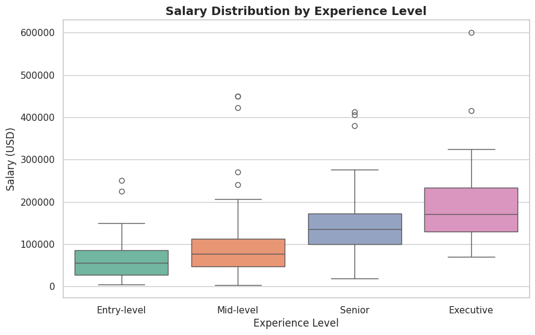
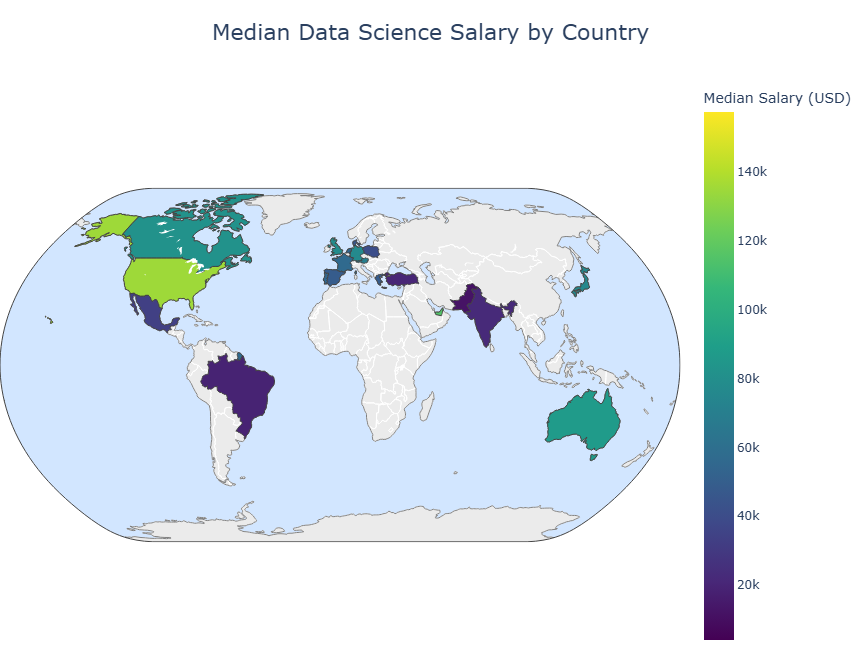
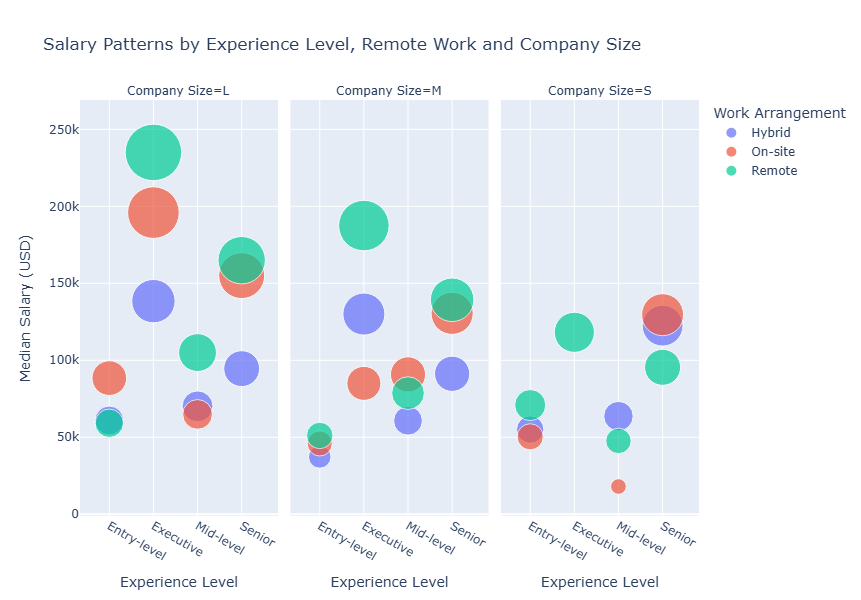

# Análisis de Salarios en Data Science

Análisis Exploratorio de Datos (EDA) sobre salarios en el sector de Data Science utilizando Python.

Este proyecto investiga cómo diferentes factores —como el nivel de experiencia, el tamaño de la empresa, la ubicación geográfica y el trabajo remoto— influyen en los salarios dentro de la industria de ciencia de datos.

---

# Objetivo del Proyecto

La demanda de profesionales de datos ha crecido rápidamente en los últimos años. Analizar los patrones salariales permite entender qué factores influyen en la compensación dentro del sector.

El objetivo de este proyecto es realizar un **análisis exploratorio de datos (EDA)** para identificar tendencias relevantes en los salarios de profesionales de Data Science a nivel global.

Este análisis busca responder preguntas como:

- ¿Cómo varían los salarios según el nivel de experiencia?
- ¿Existen diferencias salariales entre países?
- ¿Influye el tamaño de la empresa en el salario?
- ¿El trabajo remoto está asociado a salarios más altos?
- ¿Cómo han evolucionado los salarios en los últimos años?

---

# Dataset

El dataset contiene información sobre salarios de diferentes roles relacionados con Data Science en múltiples países y empresas.

Fuente del dataset:

Kaggle  
https://www.kaggle.com/datasets/ruchi798/data-science-job-salaries

Principales variables del dataset:

- **work_year** — año del registro salarial
- **experience_level** — nivel de experiencia
- **employment_type** — tipo de contrato
- **job_title** — puesto de trabajo
- **salary_in_usd** — salario anual en dólares
- **company_location** — ubicación de la empresa
- **company_size** — tamaño de la empresa
- **remote_ratio** — porcentaje de trabajo remoto

---

# Tecnologías Utilizadas

Este proyecto fue desarrollado utilizando:

- Python
- Pandas
- NumPy
- Matplotlib
- Seaborn
- Plotly

Estas herramientas se emplearon para:

- limpieza de datos
- análisis exploratorio
- visualización de datos
- identificación de patrones y tendencias

---

# Visualizaciones Principales

## Distribución Salarial por Nivel de Experiencia

Esta visualización muestra cómo el salario aumenta significativamente a medida que crece el nivel de experiencia. Los roles senior y ejecutivos presentan salarios considerablemente más altos que los puestos de nivel inicial.

---

## Distribución Global de Salarios en Data Science

El mapa geográfico muestra la concentración de salarios en diferentes regiones. Norteamérica, especialmente Estados Unidos, presenta tanto una alta concentración de puestos como los salarios más elevados.

---

## Relación entre Experiencia, Tamaño de Empresa y Trabajo Remoto

Este gráfico explora cómo interactúan diferentes factores como el nivel de experiencia, el tamaño de la empresa y el trabajo remoto en relación con el salario.

Los resultados sugieren que:

- los salarios más altos se concentran en roles senior
- muchas posiciones mejor pagadas ofrecen opciones de trabajo remoto
- empresas medianas ofrecen salarios competitivos

---

# Principales Insights

A partir del análisis exploratorio se identificaron varios patrones relevantes:

**El nivel de experiencia es el principal factor que influye en el salario**

Los salarios medianos aumentan significativamente desde posiciones junior hasta roles ejecutivos.

**Estados Unidos domina el dataset**

La mayor parte de los registros pertenecen a empresas ubicadas en Estados Unidos, que además presentan los salarios medianos más altos.

**Las empresas medianas ofrecen salarios competitivos**

En muchos casos, las empresas de tamaño medio presentan salarios medianos ligeramente superiores a los de grandes corporaciones.

**El trabajo remoto se asocia a salarios más altos**

Sin embargo, este efecto puede estar relacionado con la mayor presencia de roles senior en posiciones remotas.

**Los salarios muestran una tendencia creciente entre 2020 y 2022**

Esto refleja el rápido crecimiento de la industria de Data Science durante estos años.

---

# Notebook Interactivo

El notebook incluye visualizaciones interactivas creadas con Plotly que pueden no renderizarse correctamente en GitHub.

Puedes explorar la versión interactiva completa en Kaggle:

https://www.kaggle.com/code/wildina/data-science-salary-analysis

---

# Autor

**Carolina H.M.**

GitHub  
https://github.com/carolinahm-tech

Kaggle  
https://www.kaggle.com/wildina

---

# Licencia

Este proyecto se distribuye bajo la licencia MIT.
